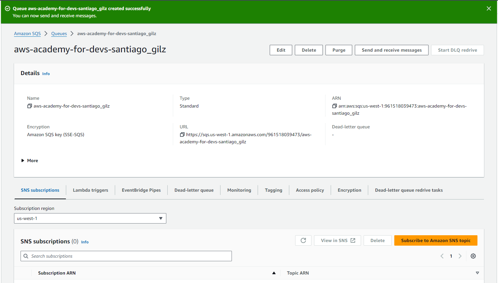
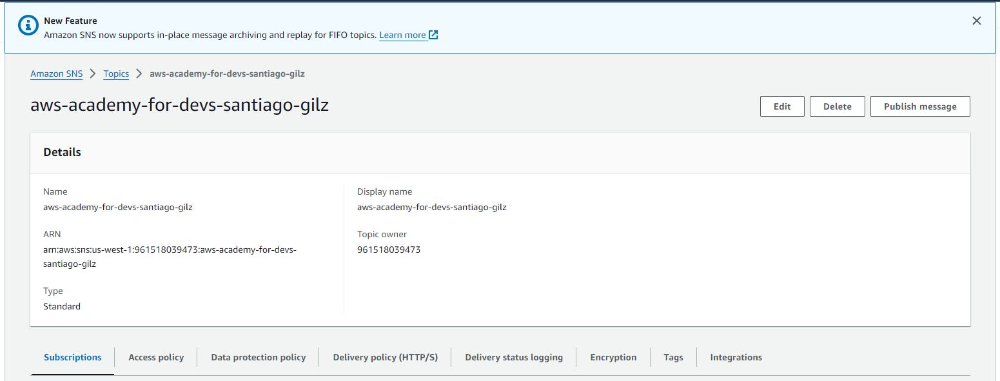
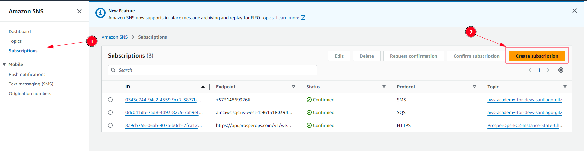
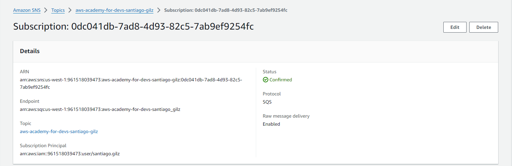
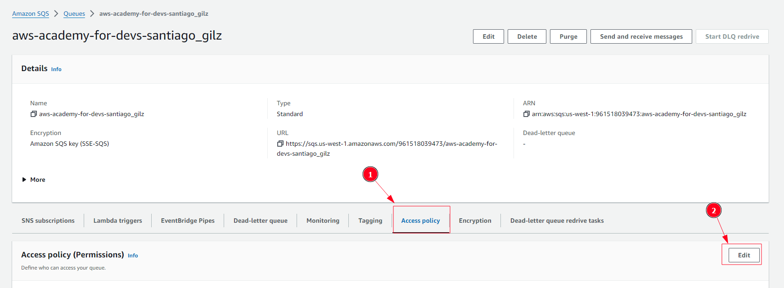

# Getting familiar with SQS and SNS using NodeJS
This is a short workshop about AWS SQS and SNS in NodeJS that helps you become familiar with both tools from NodeJS Using the AWS SDK library.

## Prerequisites

To be able to run this workshop, the following tools/facilities are required:
1. A Unix-like environment. If your PC is Linux or Mac, you are all set! if you use Windows, we recommend to [install WSL2](https://learn.microsoft.com/en-us/windows/wsl/install). You can also spin up a Linux VM machine or even run everything on a Linux container.
2. AWS CLI installed on your environment. Here is an [installation guide](https://docs.aws.amazon.com/cli/latest/userguide/getting-started-install.html).
3. AWS ACCESS and SECRET keys configured. [Creation guide](https://docs.aws.amazon.com/IAM/latest/UserGuide/id_credentials_access-keys.html#Using_CreateAccessKey).
4. NodeJS and NPM installed.

## 1. Amazon Simple Queue Service (SQS)

### Creating an SQS queue in the Amazon Console
For creating a new queue, you have to follow the next steps: 

1. Open the [Amazon SQS console](https://console.aws.amazon.com/sqs/)
2. Choose Create queue
3. The Standard queue type is selected by default (You can't change queue type after you have created it)
4. Enter a Name for your queue
5. Create the queue with the default parameters, so, scroll to the bottom and choose Create Queue

Finally, Amazon SQS creates the queue and displays the queue's details page. Here we have the following information.

### Getting started

In this section, you are going to use NodeJS, SQS, and AWS-SDK for javascript which is a library provided by Amazon to interact with its services.

### Creating our project

Create a new NodeJS project by following the steps below:

~~~bash
mkdir sqsnodejs
cd sqsnodejs
npm init -y
~~~

We need the following libraries, let's install them:

~~~bash
npm i -S @aws-sdk/client-sqs 
npm i -D dotenv
~~~
**Note**: `dotenv` will help you set environment variables needed to authenticate against AWS, and `@aws-sdk/client-sqs` will ease the interaction with Amazon SQS API.

If you want to take a look at the full solution, [here it is](https://github.com/santiago-gilz/aws-sqs-ws).

### Setting up the AWS credentials

The easiest way to connect your project to AWS is by using environment variables, let's create a .env file in your project's root folder that will be loaded by dotenv to perform that magic:

~~~config
AWS_ACCESS_KEY_ID=[YOUR_AWS_ACCESS_KEY_ID]
AWS_SECRET_ACCESS_KEY=[YOUR_AWS_SECRET_ACCESS_KEY]
AWS_REGION=[YOUR_AWS_REGION]
~~~

**Note**: you have to change values in brackets with your credentials from AWS. If you don't know how to get this information, head to the [prerequisites section](#prerequisites).

Now, it's a good idea to create a file called `SQSHelper.js` where you'll gather all the functions related to SQS.

~~~JavaScript
const { SQSClient } = require("@aws-sdk/client-sqs");

class SQSHelper {
  constructor() {
    this.sqsClient = new SQSClient();
  }
}

module.exports = SQSHelper
~~~

**Note**: When SQSClient is initialized, it takes environment variables and connects to Amazon SQS.

### Listing existing queues

Now, you created an SQSHelper class and its constructor initialized a SQSClient which will interact with Amazon SQS. Next, let's create a method to list existing queues, in the SQSHelper file add the following code:

~~~JavaScript
const { SQSClient, ListQueuesCommand } = require("@aws-sdk/client-sqs");

class SQSHelper {
  constructor() {
    this.sqsClient = new SQSClient();
  }

  listQueues() {
    return this.sqsClient.send(new ListQueuesCommand({}));
  }
}

module.exports = SQSHelper;
~~~
As you noticed, you have a new class called ListQueuesCommand imported from @aws-sdk/client-sqs, that class helps you to list existing queues from SQS. Therefore, you have an asynchronous method which uses the send method from SQSClient and as parameter it takes ListQueuesCommand where its constructor can have some parameters which are explain [here](https://docs.aws.amazon.com/AWSJavaScriptSDK/latest/AWS/SQS.html#listQueues-property).

In order to run the previous code, let's create a new file called `listQueues.js` in the root folder and add the following code:

~~~JavaScript
require("dotenv").config();
const SQSHelper = require("./SQSHelper");

(async () => {
  const sqs = new SQSHelper();
  console.log(await sqs.listQueues());
})()
~~~

Here, you imported dotenv and SQSHelper where dotenv helps you to load the environment variables you have in .env file and SQSHelper is the class you created before. In order to run it, let's create a new command in your `package.json` called `listQueuescode`. Your package file should look like this:

~~~JSON
{
  "name": "sqsnodejs",
  "version": "1.0.0",
  "description": "",
  "main": "index.js",
  "scripts": {
    "listQueues": "node listQueues.js"
  },
  "keywords": [],
  "author": "",
  "license": "ISC",
  "dependencies": {
    "@aws-sdk/client-sqs": "^3.651.1"
  },
  "devDependencies": {
    "dotenv": "^16.4.5"
  }
}
~~~

Now, to run your code, execute the following command:

~~~Bash
npm run listQueues
~~~

Your result must be pretty similar to this:

~~~JSON
{
  '$metadata': {
    httpStatusCode: 200,
    requestId: '1f207e6b-6485-588f-acd7-abcd7d0e0db6',
    extendedRequestId: undefined,
    cfId: undefined,
    attempts: 1,
    totalRetryDelay: 0
  },
  QueueUrls: [
    '[YOUR_QUEUE_URL]'
  ]
}
~~~

### Getting queue properties

Amazon has an API method which allows you to get some queue attributes mentioned on Amazon SQS article. Add the following method to your SQSHelper class:

~~~javaScript
const {
  ...
  GetQueueAttributesCommand
} = require("@aws-sdk/client-sqs");

class SQSHelper {
  ...

  getQueueAttributes(params) {
    return this.sqsClient.send(new GetQueueAttributesCommand(params));
  }

  ...
}
~~~

We've imported a new class called GetQueueAttributesCommand from the @aws-sdk/client-sqs package. This command lets you get information about an SQS queue. You'll need to provide the queue's URL as input. For a complete list of possible parameters, check [this link](https://docs.aws.amazon.com/AWSJavaScriptSDK/latest/AWS/SQS.html#getQueueAttributes-property).

Create a new file named `getQueueAttributes.js` in your root project folder. When you run this file, make sure to include the **QueueUrl** and **AttributeNames** parameters. AttributeNames specifies which specific details you want to retrieve from the queue:

~~~javaScript
require("dotenv").config();
const SQSHelper = require("./SQSHelper");

(async () => {
  const sqs = new SQSHelper();
  const params = {
    QueueUrl: "[YOUR_QUEUE_URL]",
    AttributeNames: ["All"],
  };
  console.log(await sqs.getQueueAttributes(params));
})();
~~~

Again, We will add a new command in your `package.json` called **getQueueAttributes**:

~~~JSON
{
  ...
  "scripts": {
    "listQueues": "node listQueues.js",
    "getQueueAttributes": "node getQueueAttributes"
  },
  ...
}
~~~

Execute the following command in your terminal:
~~~Bash
npm run getQueueAttributes
~~~

You will get something like this:

~~~JSON
{
  '$metadata': {
    httpStatusCode: 200,
    requestId: '76592950-a9d3-50af-b063-70ed3c4b165d',
    extendedRequestId: undefined,
    cfId: undefined,
    attempts: 1,
    totalRetryDelay: 0
  },
  Attributes: {
    QueueArn: '[YOUR_CURRENT_QUEUE_ARN]',
    ApproximateNumberOfMessages: '0',
    ApproximateNumberOfMessagesNotVisible: '0',
    ApproximateNumberOfMessagesDelayed: '0',
    CreatedTimestamp: '1631573601',
    LastModifiedTimestamp: '1631573601',
    VisibilityTimeout: '30',
    MaximumMessageSize: '262144',
    MessageRetentionPeriod: '345600',
    DelaySeconds: '0',
    Policy: '[YOUR_CURRENT_QUEUE_POLICY]',
    ReceiveMessageWaitTimeSeconds: '0'
  }
}
~~~

### Sending a message to a queue

Let's create a new method to send a message to the queue taking the default parameters set when the queue was created. In the SQSHelper file, add the following code:

~~~JavaScript
const {
  ...
  SendMessageCommand,
} = require("@aws-sdk/client-sqs");

class SQSHelper {
  ...

  sendMessage(params) {
    return this.sqsClient.send(new SendMessageCommand(params));
  }
}

module.exports = SQSHelper;
~~~

We've added a new command called **SendMessageCommand** from the `@aws-sdk/client-sqs package`. This command lets you send a message to an SQS queue.

Create a new file named `sendMessage.js` in your main project folder and add the following code:

~~~JavaScript
require("dotenv").config();
const SQSHelper = require("./SQSHelper");

(async () => {
  const sqs = new SQSHelper();
  const params = {
    QueueUrl: "[YOUR_QUEUE_URL]",
    MessageBody: JSON.stringify({
      message: "Hello AWS SQS!",
    }),
  };
  console.log(await sqs.sendMessage(params));
})();
~~~

To use this command, you'll need to provide two pieces of information: the queue's URL and the message you want to send. The message should be a simple text string. This message will be stored in SQS and can be retrieved later.

For more details on additional parameters you can use, check [this link](https://docs.aws.amazon.com/AWSJavaScriptSDK/latest/AWS/SQS.html#sendMessage-property).

Now, let's test this command. Add a new script called sendMessage to your `package.json` file and add the following code:

~~~JSON
{
  ...
  "scripts": {
    "listQueues": "node listQueues",
    "getQueueAttributes": "node getQueueAttributes",
    "sendMessage": "node sendMessage"
  },
  ...
}
~~~

Now run the next two commands:

~~~Bash
npm run sendMessage
npm run getQueueAttributes
~~~

After running the previous commands, you'll see a property called **ApproximateNumberOfMessages**. If its value is 1, it means there's one message waiting in the queue. You can also verify this information by checking the queue details on the Amazon SQS console.

~~~JSON
{
  '$metadata': {
    httpStatusCode: 200,
    requestId: '607e5260-3c23-53f7-a5fb-0ba475e18181',
    extendedRequestId: undefined,
    cfId: undefined,
    attempts: 1,
    totalRetryDelay: 0
  },
  Attributes: {
    QueueArn: "[YOUR_QUEUE_ARN]",
    ApproximateNumberOfMessages: '1',
    ApproximateNumberOfMessagesNotVisible: '0',
    ApproximateNumberOfMessagesDelayed: '0',
    CreatedTimestamp: '1631573601',
    LastModifiedTimestamp: '1631573601',
    VisibilityTimeout: '30',
    MaximumMessageSize: '262144',
    MessageRetentionPeriod: '345600',
    DelaySeconds: '0',
    Policy: "[YOUR_POLICY]",
    ReceiveMessageWaitTimeSeconds: '0'
  }
}
~~~

### Receiving messages from a queue

To work with Amazon SQS, you'll need to send and receive messages. Let's create a function to receive messages from SQS. Add the following code to the `SQSHelper` file:

~~~JavaScript
const {
  ...
  ReceiveMessageCommand
} = require("@aws-sdk/client-sqs");

class SQSHelper {
  ...

  receiveMessage(params) {
    return this.sqsClient.send(new ReceiveMessageCommand(params));
  }
}

module.exports = SQSHelper;
~~~

We've added a new command called ReceiveMessageCommand from the @aws-sdk/client-sqs package. This command lets you receive a message from an SQS queue.

Create a new file named `receiveMessage.js` and add the following code:

~~~JavaScript
require("dotenv").config();
const SQSHelper = require("./SQSHelper");

(async () => {
  const sqs = new SQSHelper();
  const params = {
    QueueUrl: "[YOUR_QUEUE_URL]",
    MaxNumberOfMessages: 1,
  };
  console.log(await sqs.receiveMessage(params));
})();
~~~

To use this command, you'll need to provide the queue's URL and the maximum number of messages you want to receive. Keep in mind that the maximum number per request is 10.

For more details on additional parameters you can use, check [this link](https://docs.aws.amazon.com/AWSJavaScriptSDK/latest/AWS/SQS.html#receiveMessage-property).

Now, let's test this command. Add a new script called receiveMessage to your package.json file and add the following code:

~~~JSON
{
  ...
  "scripts": {
    "listQueues": "node listQueues.js",
    "getQueueAttributes": "node getQueueAttributes",
    "sendMessage": "node sendMessage",
    "receiveMessage": "node receiveMessage"
  },
  ...
}
~~~

To check what you just developed, run the following command in your terminal:

~~~Bash
npm run receiveMessage
~~~

The output will be an object containing a property called **Messages**. This property will hold an array of received messages. The first message in the array will have a body property containing the content you sent to the queue:

~~~JSON
{
  '$metadata': {
    httpStatusCode: 200,
    requestId: '6e393410-f5b6-56e2-acfb-6dd4baeabef3',
    extendedRequestId: undefined,
    cfId: undefined,
    attempts: 1,
    totalRetryDelay: 0
  },
  Messages: [
    {
      MessageId: '28ae9326-bb9a-4788-b35d-5e7a4b3dcc86',
      ReceiptHandle: "[YOUR_RECEIPT_HANDLE]",
      MD5OfBody: 'd66a75e8c90fcceebe7a2ff57635cba9',
      Body: '{"message":"Hello AWS SQS!"}',
      Attributes: undefined,
      MD5OfMessageAttributes: undefined,
      MessageAttributes: undefined
    }
  ]
}
~~~

Indeed, once this message reaches visibility timeout, it will be appearing once again until a consumer deletes it or the message reaches the retention period of time set.

### Deleting a message from a queue

After receiving a message from SQS, you should delete it to prevent it from being received again. Let's create a new function to delete messages. Add the following code to the `SQSHelper` file:

~~~JavaScript
const {
  ...
  DeleteMessageCommand
} = require("@aws-sdk/client-sqs");

class SQSHelper {
  ...

  deleteMessage(params) {
    return this.sqsClient.send(new DeleteMessageCommand(params));
  }
}

module.exports = SQSHelper;
~~~

We've added a new command called **DeleteMessageCommand** from the `@aws-sdk/client-sqs` package. This command lets you delete a message from an SQS queue.

Create a new file named `deleteMessage.js` in your main project folder with the following code in it:

~~~JavaScript
require("dotenv").config();
const SQSHelper = require("./SQSHelper");

(async () => {
  const sqs = new SQSHelper();
  const params = {
    QueueUrl: "[YOUR_QUEUE_URL]",
    ReceiptHandle: "[YOUR_RECEIPT_HANDLE]",
  };
  console.log(await sqs.deleteMessage(params));
})();
~~~

To use this command, you'll need to provide the queue's URL and the `ReceiptHandle` property that was returned when you received the message.

Now, let's test this command. Add a new script called `deleteMessage` to your `package.json` file and add the following code:

~~~JSON
{
  ...
  "scripts": {
    "listQueues": "node listQueues.js",
    "getQueueAttributes": "node getQueueAttributes",
    "sendMessage": "node sendMessage",
    "receiveMessage": "node receiveMessage",
    "deleteMessage": "node deleteMessage"
  },
  ...
}
~~~

Now, execute the next commands in your terminal:

~~~Bash
npm run deleteMessage
npm run getQueueAttributes
~~~

After running the previous command, you'll see a property called `ApproximateNumberOfMessages`. If its value is 0, it means the message has been deleted:

~~~JSON
{
  '$metadata': {
    httpStatusCode: 200,
    requestId: 'd3873207-2455-542f-a909-6bc346b0753e',
    extendedRequestId: undefined,
    cfId: undefined,
    attempts: 1,
    totalRetryDelay: 0
  },
  Attributes: {
    QueueArn: "[YOUR_QUEUE_ARN]",
    ApproximateNumberOfMessages: '0',
    ApproximateNumberOfMessagesNotVisible: '0',
    ApproximateNumberOfMessagesDelayed: '0',
    CreatedTimestamp: '1631573601',
    LastModifiedTimestamp: '1631573601',
    VisibilityTimeout: '30',
    MaximumMessageSize: '262144',
    MessageRetentionPeriod: '345600',
    DelaySeconds: '0',
    Policy: "[YOUR_QUEUE_POLICY]",
    ReceiveMessageWaitTimeSeconds: '0'
  }
}
~~~

## 2. Amazon Simple Notification Service (SNS)

### Configure SNS-related resources in the Amazon Console
For creating a new topic, you have to follow the next steps: 

1. Open the [Amazon SNS console](https://us-west-1.console.aws.amazon.com/sns/v3/home?region=us-west-1#/topics)
2. Choose **Create topic**
3. Change the topic type to Standard as we did with the SQS queue (You can't change topic type after you have created it)
4. Enter a Name for your topic
5. Create the topic with the default parameters, so, scroll to the bottom and choose **Create topic**

Finally, Amazon SNS creates the topic and displays the topic's details page. Here we have the following information.

6. Head to the subscriptions tab as shown on the image below and Click on **Create subscription**.

7. In the **Topic ARN** field, Choose the topic ARN of the topic you just created. **Note:** the Amazon Resource Name (ARN) is a unique ID associated to every resource created in amazon. You can find it on the every resource's description tab.
8. In the **Protocol** field, choose **Amazon SQS**.
9. In the **Endpoint** field, choose the SQS queue we created in [this section](#creating-an-sqs-queue-in-the-amazon-console)
10. Check the button **Enable raw message delivery**.
11. Click on **Create subscription**.

Finally, Amazon SNS creates the subscription and displays its details page. Here we have the following information.

12. Let's create a second subscription but change the following fields:
  - In the **Protocol** field, choose **SMS**.
  - As we are using a sandbox account (free tier), we will need to verify the ownership of our number. Before choosing the Endpoint, Click on Add number > enter your phone number > choose your preferred language > click on **Add phone number**. Then confirm the code that you will receive via SMS. 
  - In the **Endpoint** field, enter the country code followed by your phone number like this: for Colombia the code is +57 and my number is 3124567890, an example can be: +573124567890.
13. Click on **Create subscription**.
14. Go back to the [Amazon SQS console](https://console.aws.amazon.com/sqs/). And, enter your queue's main page.
15. Click on **Access policy** > **Edit** as shown on the following image.

1.  Change the JSON-formatted policy with the following one. **NOTE**: Replace the values `YOUR_QUEUE_ARN` and `YOUR_TOPIC_ARN` with the queue and topic ARNs respectively. Again, those can be found on each resource's description page:
~~~JSON
{
  "Version": "2012-10-17",
  "Id": "__default_policy_ID",
  "Statement": [
    {
      "Sid": "__owner_statement",
      "Effect": "Allow",
      "Principal": {
        "AWS": "arn:aws:iam::961518039473:root"
      },
      "Action": "SQS:*",
      "Resource": "YOUR_QUEUE_ARN"
    },
    {
      "Effect": "Allow",
      "Principal": {
        "Service": "sns.amazonaws.com"
      },
      "Action": "sqs:SendMessage",
      "Resource": "YOUR_QUEUE_ARN",
      "Condition": {
        "ArnEquals": {
          "aws:SourceArn": "YOUR_TOPIC_ARN"
        }
      }
    }
  ]
}
~~~
**Note:** This policy controls who can access the queue, with this change we are adding a second statement that allows the SNS topic to send messages to the SQS queue.

### Getting started
In this section, you are going to add a last command to the list of methods that we previously used to interact with SQS. But this time, we will interact with the SNS service instead.

In your environment, go to the NodeJS project that we named **sqsnodejs**. We need also the following library, let's install it:

~~~bash
npm i -S @aws-sdk/client-sns 
~~~
**Note**: `@aws-sdk/client-sns` will ease the interaction with Amazon SNS API as well as it happens with the SQS one.

Now, it's a good idea to create a separate file called `SNSHelper.js` where you'll gather all the functions related to SNS. You are free to order your code as you prefer, but we think separating each service's helper is better:

~~~JavaScript
const {
  SNSClient
} = require("@aws-sdk/client-sns");

class SNSHelper {
  constructor() {
    this.snsClient = new SNSClient();
  }
}

module.exports = SNSHelper;
~~~

**Note**: When SNSClient is initialized, it also takes environment variables and connects to Amazon SNS due to the `dotenv` library and [credentials setup](#setting-up-the-aws-credentials) we did for the SQS part.

### Publishing messages in the SNS topic

Now, you created an SNSHelper class and its constructor initialized a SNSClient which will interact with Amazon SNS. Next, let's create a method to publish messages in the topic, in the SNSHelper file add the following code:

~~~JavaScript
const {
  SNSClient,
  PublishCommand
} = require("@aws-sdk/client-sns");

class SNSHelper {
  constructor() {
    this.snsClient = new SNSClient();
  }

  publishMessage(params) {
    return this.snsClient.send(new PublishCommand(params));
  }
}

module.exports = SNSHelper;
~~~

We've added a new command called **PublishCommand** from the `@aws-sdk/client-sns package`. This command lets you publish a message to an SNS topic.

Create a new file named `publishMessage.js` in your main project folder and add the following code:

~~~JavaScript
require("dotenv").config();
const SNSHelper = require("./SNSHelper");

(async () => {
  const sns = new SNSHelper();
  const params = {
    TopicArn: "[YOUR TOPIC ARN]",
    MessageStructure: "json",
    Message: JSON.stringify({
      default: "This is a test message",
      sqs: "Hey! SQS, process this.",
      sms: "ALERT: SQS has been notified about the message."
    }),
  };
  console.log(await sns.publishMessage(params));
})();
~~~

To use this command, you'll need to replace the string `"[YOUR TOPIC ARN]"` with the SNS topic's ARN. You could simply send a single string as message that would be propagated to all the subscribers, but let's test how powerful this service can be. If we set the `MessageStructure` as **"json"**, we can then specify the custom message each subscriber type should receive. Remember we subscribed 2 different consumers (an SQS queue and a phone number for SMS). A default message must be also set, in case we have a different subscriber that is not customized.

For more details on additional parameters you can use, check [this link](https://docs.aws.amazon.com/AWSJavaScriptSDK/latest/AWS/SNS.html#publish-property).

Now, let's test this command. Add a new script called `publishMessage`  to your `package.json` file. Your Scripts section of the package.json file should look like this:

~~~JSON
{
  ...
  "scripts": {
    "listQueues": "node listQueues",
    "getQueueAttributes": "node getQueueAttributes",
    "sendMessage": "node sendMessage",
    "receiveMessage": "node receiveMessage",
    "deleteMessage": "node deleteMessage",
    "publishMessage": "node publishMessage"
  },
  ...
}
~~~

Now run the next command:

~~~Bash
npm run publishMessage
~~~

At this point, you published your first notification. The topic will proceed to propagate each custom message to the corresponding subscribers. The following two consequential actions will happen:
1. You must have received an SMS in your registered phone.
2. A new message has been pushed to the registered SQS queue.

Let's test how true that is. Let's first check the queue's attributes and then retrieve the message from the queue using the commands that we built for the first stage:

~~~Bash
npm run getQueueAttributes
npm run receiveMessage
~~~

The first command should get the property called **ApproximateNumberOfMessages** with the modified count of messages in the queue. The last one, should bring the message we published to the SNS topic and should look like this:

~~~JSON
{
  '$metadata': {
    httpStatusCode: 200,
    requestId: '6fab1835-0abe-54b9-a73d-4752b5b8e4be',
    extendedRequestId: undefined,
    cfId: undefined,
    attempts: 1,
    totalRetryDelay: 0
  },
  Messages: [
    {
      Body: 'Hey! SQS, process this.',
      MD5OfBody: '6478b72fc8d2f49a22027ed9a1ec4f03',
      MessageId: 'ec9b06e3-b882-4c6f-9912-374fc339022a',
      ReceiptHandle: 'AQEBlfh1o/98TAE7P4WLDV3gW2t1OxMc2u+0CGAIWpztLRwRamKeu+ni65q/rQEa2pIwskm2OJ8mK8bDcCAuWYjrumt0E025R5/q1FZlB7DCFplZi9s7IKQnycd0+igco9JBgZYz5hnEqSCZ5oTlPT7MhKEm/KM84ICwAKlD/POT5zmcEXKOwWydL0Q6WPCfuMAcXtDjmSLJv6CVlnoU8kFZ92mGts3EcEcoRg/dEDjYPGRnUvOXJQm4ftzC/fr0C6iSwDkmDZtLXpAZVB6HEIGOjQPNYUY406wCAecFYri0LRGWLg0GwiXi8/JTpvXRhtXhEcBOP3W7IVZD6zRClFLcbQKu9zGmUTuq3MLX4V7F4zjOoOYv/IwYfd8EPG0HlziFt/rfRH15YuHMoylON+cwo23HuFEa5I8hnAgGDvMasjddjk='
    }
  ]
}
~~~

Notice that the message **body** has the actual string we published using the `publishMessage` command.

### Do it your-self
What if we build some other cool commands for the remaining actions to work with SNS? Here are some ideas to dig into the rest of the SDK:
- listTopics
- listSubscriptions
- getTopicAttributes
- publishBatch

## Conclusion

We've covered some fundamental methods for using Amazon SQS and SNS with Node.js. However, there are many more methods available that weren't discussed in this Workshop. Now that you have a basic understanding, you can explore the [Amazon SQS documentation](https://docs.aws.amazon.com/AWSJavaScriptSDK/v3/latest/client/sqs/) and [Amazon SNS documentation](https://docs.aws.amazon.com/AWSJavaScriptSDK/v3/latest/client/sns/) for more in-depth information.

